[中文](README.md) / English

    

## About

neatlogic-autoexec is an automation module that enables one-click automation execution of various scenarios by combining
code scripts. For example, it can be used for tasks like MySQL database installation. The module includes features such
as custom tools, composite tools, and job management. It also utilizes the automatic discovery feature
of [neatlogic-deploy](../../../neatlogic-deploy/blob/develop3.0.0/README.en.md), [neatlogic-inspect](../../../neatlogic-inspect/blob/develop3.0.0/README.en.md),
and [neatlogic-cmdb](../../../neatlogic-cmdb/blob/develop3.0.0/README.en.md) for automated deployment, inspection, and
configuration management. neatlogic-autoexec cannot be deployed or built independently. For building and deployment
instructions, please refer to the documentation
of [neatlogic-itom-all](../../../neatlogic-itom-all/blob/develop3.0.0/README.en.md).

## Architecture Diagram

neatlogic-autoexec is a management platform for automation modules, primarily used for configuring automation jobs. To
execute these jobs, it requires support
from [neatlogic-runner](../../../neatlogic-runner/blob/develop3.0.0/README.en.md)
and [neatlogic-autoexec-backend](../../../neatlogic-autoexec-backend/blob/master/README.en.md). [neatlogic-autoexec-scripts](../../../neatlogic-autoexec-scripts/blob/master/README.en.md)
contains a large number of original scripts that cover complex scenarios such as database installation, virtual machine
replication, and disaster recovery switchover.
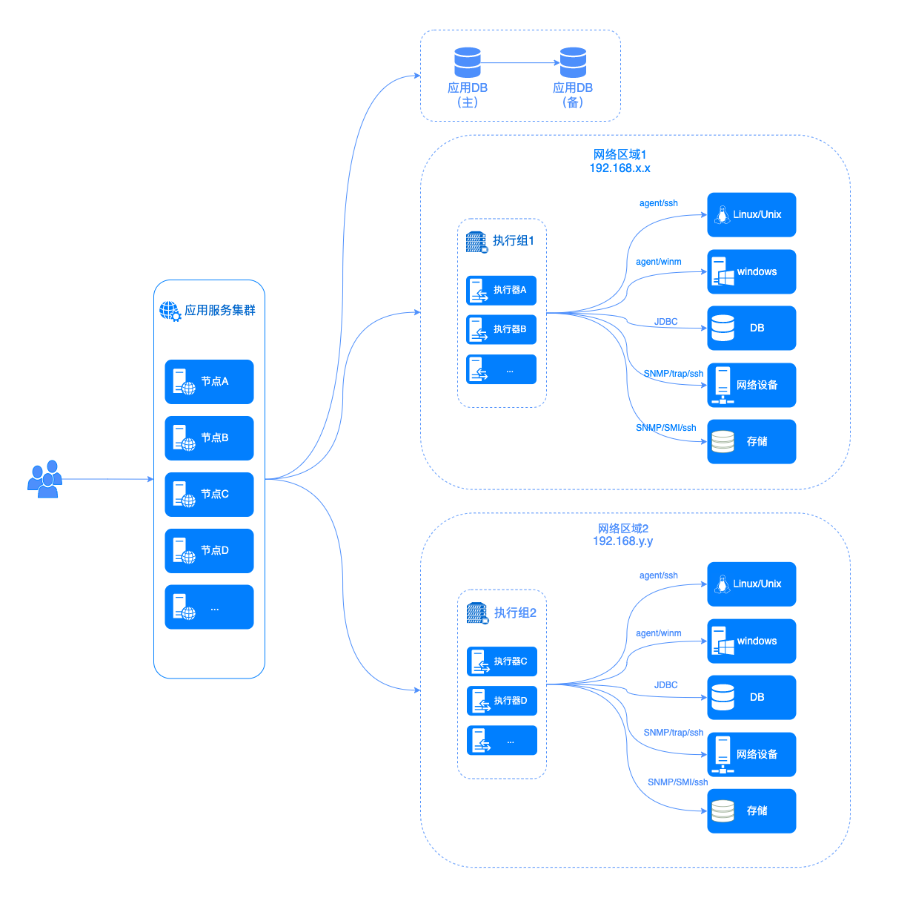

## Key Terminology

### Orchestration (Composite Tool)

Multiple phase groups are combined to form an orchestration, which is the smallest unit of automation deployment. Atomic
tools need to be included in an orchestration in order to be executed. Multiple phase groups within an orchestration are
executed in a sequential manner.
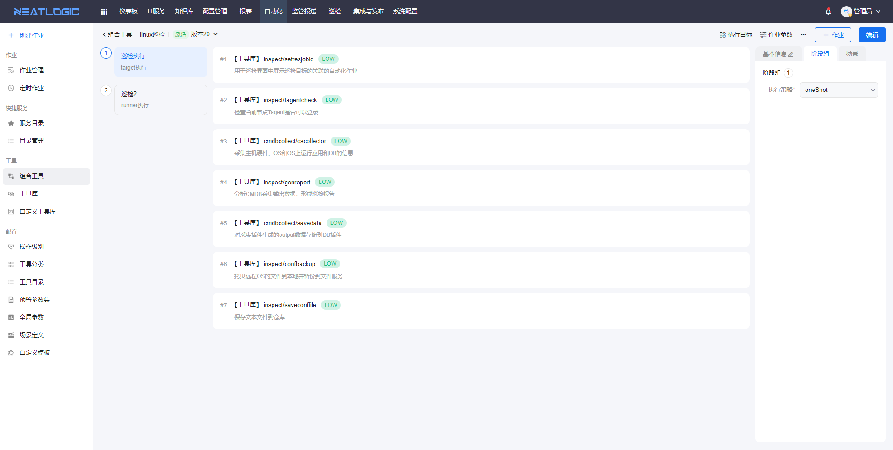

### Phase Group

Multiple stages are combined in parallel to form a phase group. A phase group consists of multiple stages, which can be
executed in parallel (oneshot executing) or sequentially on multiple target nodes (gray scale executing). Each batch of
nodes executes the stages within the phase group in sequence before initiating the next batch.

### Stage

Multiple atomic tools are combined to form a stage, where the atomic tools within the same stage are executed in the
specified order. If a stage has multiple target nodes, they can be executed in multiple batches. The atomic tools within
a stage are executed sequentially on the same node.

### Atomic Tool

An atomic tool is similar to a command-line tool developed independently. It accepts named parameters or anonymous
parameters (free parameters) and performs designated functions based on the input parameters. It outputs other
parameters as required for subsequent tool usage.

#### Classification by Execution Mode

Atomic tools are classified into three categories based on their execution mode: runner executing, remote executing, and
runner to remote executing.

##### Runner Executing: Atomic tools are executed locally on the operating system where the automation scheduler (runner) is running.

##### Remote Executing: Atomic tools are pushed by the automation scheduler to the remote server's operating system and executed under a specific user's identity.

##### Runner to Remote Executing: Atomic tools are executed on the operating system where the runner is running, and the tools connect to remote servers or other automation targets for relevant processing.

#### Classification by Development Mode

Atomic tools are classified into built-in tools and customized tools based on their development mode.

##### Built-in Tools: Released along with the automation scheduler version, built-in tools primarily include standardized functionalities such as parameter aggregation, parameter extraction, environment variable settings, conditional routing, file copying, file processing, and simple custom script execution.

##### Customized Tools

: Custom scripts, libraries, or packages that can be managed through the custom tool management interface. They are used
to perform non-standard tasks with specific user characteristics. Import and export tools are provided to facilitate the
import and export of custom tools to SVN or Git. Custom scripts can also be managed using Git or SVN.

Demo orchestration example:
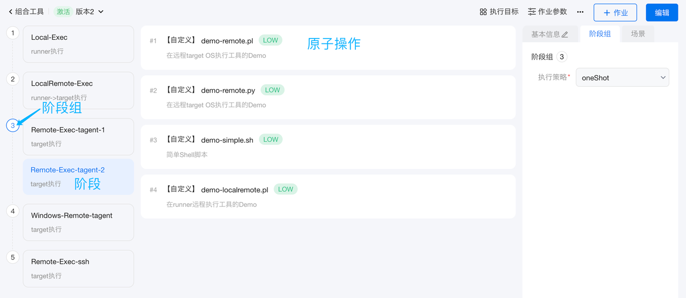

## Core Features of Orchestration

By combining multiple atomic tools and their input/output parameters, predefined functionalities can be achieved through
the sequential and parallel execution of the tools. The core features include orchestration editing, phase group
settings, stage settings, execution flow control, orchestration parameter definition, atomic tool parameter input,
parameter referencing, parameter extraction, and parameter aggregation.

### Execution Flow Control

Automation execution involves tasks such as sequential and parallel execution across multiple target nodes, batch
execution, conditional branching, and parameter passing.

#### Common Execution Flows

##### Sequential Execution on Multiple Target Nodes

Use a phase group to include multiple stages within the same group. Set the phase group to "grayScale" execution mode
and select the target execution nodes. Set the execution mode to sequential. This ensures that the stages within the
phase group are executed on each target node in sequence.

##### Parallel Execution on Multiple Target Nodes

Use a phase group to include multiple stages within the same group. Set the phase group to "oneshot" execution mode and
select the target execution nodes. Set the execution mode to parallel. This allows multiple target nodes to execute the
stages within the phase group concurrently.
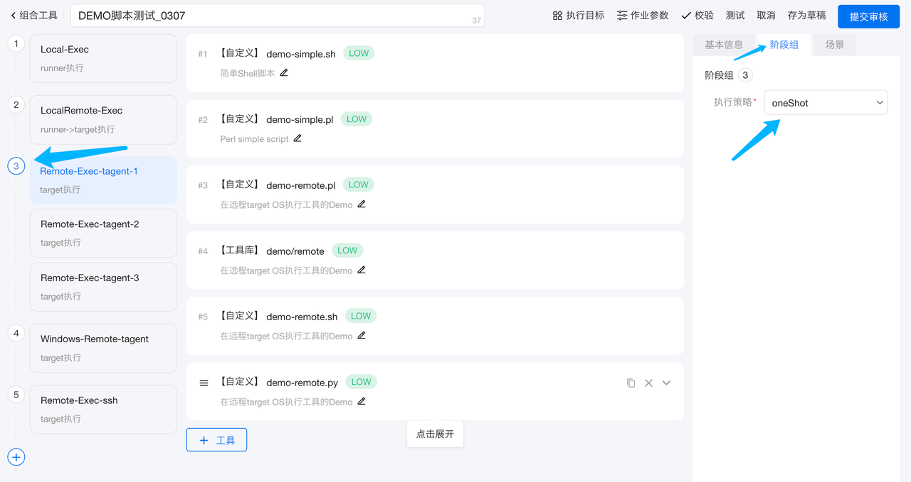

##### Batch Execution on Multiple Target Nodes for a Single Stage

Set individual batch execution strategies for the target stages (if not set individually, the batch strategy at the job
level will be used). Specify the batch quantity. Multiple target nodes will be divided into batches and execute the
stages in batches.
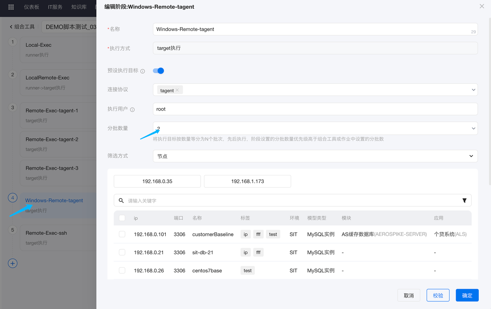

##### Batch Execution on Multiple Target Nodes for Multiple Stages

Set individual batch execution strategies for the target phase group (if not set individually, the batch strategy at the
job level will be used). Specify the batch quantity. Multiple target nodes will be divided into batches and execute the
stages within the phase group in a sequential manner.
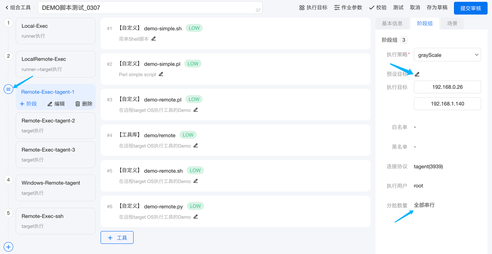
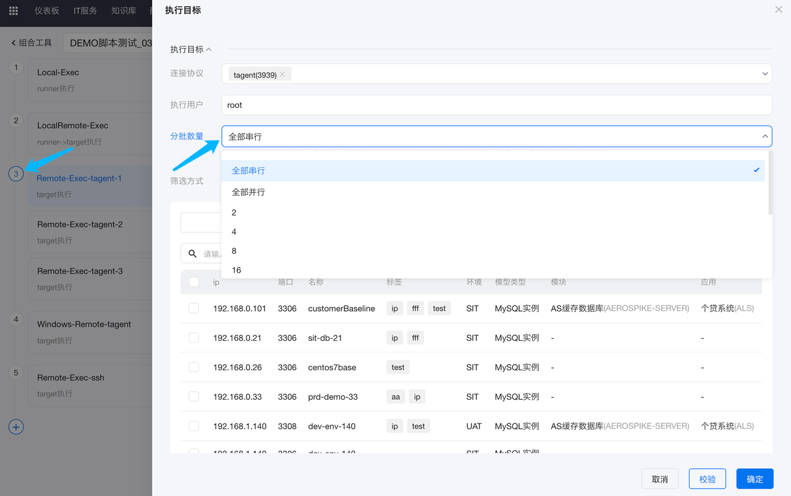

##### Sequential Execution of Multiple Stages on Multiple Target Nodes

Configure multiple phase groups within the orchestration, with each phase group containing a single stage. The stages
will be executed one after another, and all target nodes must complete the current stage before moving on to the next
stage.

##### Execution without Remote Target Nodes

Set the stage execution mode to runner executing, which does not require specifying target execution nodes. This is
generally used for pre-processing or post-processing that involves multiple target nodes to prepare or aggregate data.

##### Combining Multiple Execution Strategies

Execution modes can be set at the global, phase group, and stage levels. By combining phase groups and stages, complex
execution strategy requirements can be achieved.
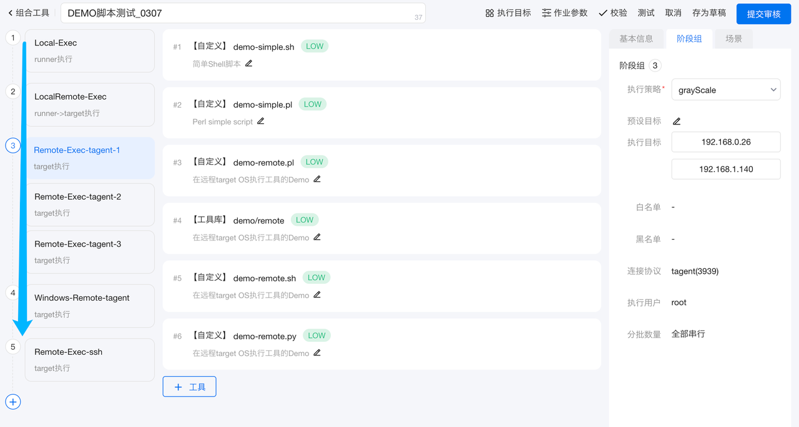

##### Conditional Execution

The automation scheduler provides the built-in IF-Block tool, which allows for conditional checks and if...else...
handling. Conditional statements can be based on environment variable values or the existence of files.
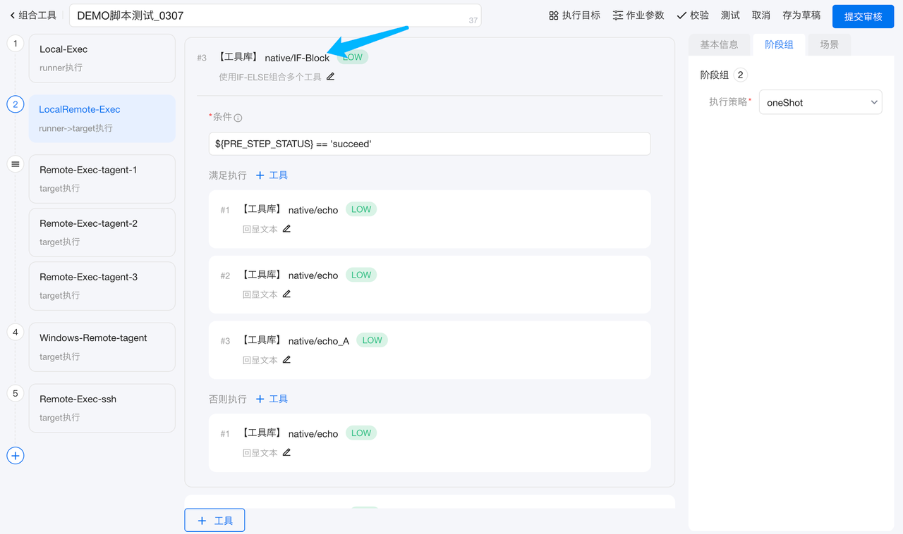

#### Job Failure Exit

##### native/failjob

This tool allows for intentional exit of a job. It is usually used in conjunction with IF-Else to fail and exit the job
based on specific conditions.

##### native/failkeys

This tool enables the failure and exit of a job when specific keywords or regular expressions are detected in the log.

### Parameter Passing and Referencing

#### Parameter Scope

Parameters have two scopes: global scope and node-specific scope. Node-specific parameters can be aggregated and
transformed into global parameters using native tools.

##### Node Scope

Output parameters generated by tools executed on remote nodes have a scope limited to the respective node. Atomic tools
will only see the upstream output parameters belonging to the same node when executed on that node.

##### Global Scope

Output parameters generated by tools executed locally on the Runner OS have a global scope, visible and referenceable by
all other nodes.

##### Parameter Extraction, Aggregation, and Scope Transformation

###### native/extractoutval built-in tool

Extracts the output of upstream tools without changing the scope. Generally used to extract and provide a portion of
data (in JSON format) collected by various target nodes to downstream tools within the same node.

###### basic/aggoutput built-in tool

Aggregates and transforms the output of multiple nodes into a JSON object with a global scope, providing it to
downstream nodes. Recommended for use with a limited number of nodes (not exceeding 32).

###### basic/concatoutout built-in tool

Concatenates the output of a specific variable from multiple nodes, supporting string and array concatenation.
Recommended for use with a limited number of nodes (not exceeding 32). Output can be in multiple formats: multi-line
text or JSON text.

###### basic/mergeoutput built-in tool

Performs a union operation on a key-value collection from multiple nodes, resulting in a JSON object with a global
scope. Recommended for use with a limited number of nodes (not exceeding 32), providing the output to downstream nodes.

##### Environment Variables

The native/setenv tool can be used to set environment variables, which also have node-specific and global scopes. The
scope is determined by the parameters of setenv.

##### Global Variables

Automation includes global variable definition configurations and the ability to modify the values of already configured
global variables during execution. This is generally used in automation scenarios that involve certain
continuity-related processing based on execution time. For example, the last reconciliation time generated at the end of
the day in a banking system. This time is updated automatically after each reconciliation, and it is used as input for
the next day's automated reconciliation scheduling.

###### native/updategparam

Updates the value of a specific variable in the global parameter table.

#### Parameter Referencing

Parameters can be referenced in three ways: referencing job parameters (which have a global scope and can be referenced
anywhere) by selecting them in the orchestration interface, referencing upstream tool output parameters (taking note of
the scope, as node-specific parameters cannot be referenced across nodes) by selecting and using them in the
orchestration interface, or referencing environment variables using the format `${variable_name}`. There are four types
of environment variables: 1) Runner process environment variables, 2) built-in environment variables (AUTOEXEC_JOBID,
AUTOEXEC_NODE, NODE_NAME, NODE_HOST, NODE_PORT), where AUTOEXEC_NODE is in JSON format and the others are regular text,

3) environment variables set using native/setenv (note the scope), and 4) job parameters (which also act as environment
   variables, taking care not to conflict with built-in environment variables).

### Manual Intervention during Execution

#### Manual Control during Execution

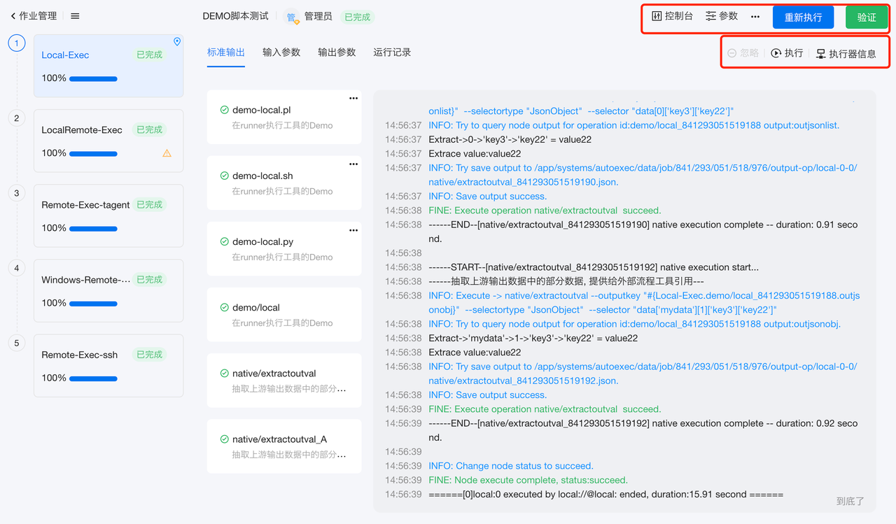
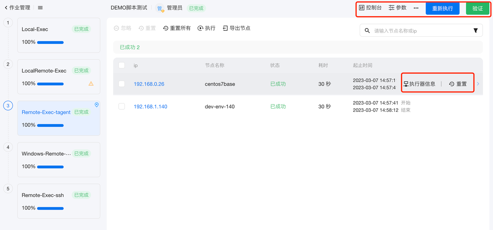

##### Job Details and Logs

Click on the "Job Management" menu in the automation module to view the job list. Click on a specific job to view its
details. The job details page displays the execution status of each stage and node. In the upper-right corner of the job
details page, there are buttons for viewing job console logs, execution records, pausing, stopping, and restarting the
job.

In the stage details section, there are execution buttons at the top. In the specific node list, real-time logs and
execution records can be viewed.

##### Pause Execution

Pausing execution, also known as graceful stop. Open the job details page and click the "Pause" button in the
upper-right corner of the job execution interface. The job will pause after completing the currently executing atomic
operation. The executing stage and job will be in the "Paused" state.

##### Stop Execution

Forcefully terminate the execution of the current job. Open the job details page and click the "Stop" button in the
upper-right corner of the job execution interface. All ongoing operations of the job will be forcefully stopped, and the
executing nodes, stages, and the job itself will enter the "Stopped" state.

##### Resume Execution

After a job has been paused, click the "Restart" button in the upper-right corner of the job details page. A dialog box
will appear, select "Skip succeeded or ignored nodes", and click "Confirm". This will skip the operations of nodes that
have already succeeded or been ignored and continue executing the failed or unexecuted stages.

##### Restart Execution

After a job has been stopped, click the "Restart" button in the upper-right corner of the job details page. A dialog box
will appear, select "Restart all", and click "Confirm". This will reset all statuses and restart the job from the
beginning.

##### Continue Execution of a Specific Stage

In the job details page, click on a specific stage and then click the "Execute" button in the stage details page. A
dialog box will appear, select "Skip succeeded or ignored nodes", and click "Confirm". This will skip the operations of
nodes that have already succeeded or been ignored and continue executing the failed or unexecuted operations of the
current stage. The execution of downstream stages will not be triggered, and the job will remain in the "In Progress"
state.

##### Restart Execution of a Specific Stage

In the job details page, click on a specific stage and then click the "Execute" button in the stage details page. A
dialog box will appear, select "Restart all", and click "Confirm". This will reset the status of the current stage and
restart it from the beginning. The execution of downstream stages will not be triggered, and the job will remain in
the "In Progress" state.

##### Restart Execution of a Specific Node

In the job details page, click on a specific stage, and then click the "Restart" button in the node details page. This
will restart the execution of that specific node. After the node has completed execution, downstream nodes or stages
will not be triggered. The job will remain in the "In Progress" state.

#### User Input during Execution

The interact/interact tool can be used to interactively input values during the execution process. The input parameters
can be referenced by downstream tools. The interact/continue tool supports confirmation prompts during the execution
process. Selecting "No" will stop the execution.

### Connectivity Check and Wait Tools

In automation scenarios related to environment installation, it is often necessary to wait for a service to start after
software installation before proceeding to the next step. In such cases, the built-in check and wait tools can be used
to check connectivity and wait (avoid using the sleep tool for artificial delays, as it is not the correct method).

#### inspect/pingcheckwait tool

Continuously pings a specific IP address, retrying until the maximum number of retries specified by the parameters is
reached. If the connection is still not established, it will result in a failure exit.

#### inspect/tcpcheckwait tool

Performs a continuous TCP three-way handshake, retrying until the maximum number of retries specified by the parameters
is reached. If the connection is still

not established, it will result in a failure exit.

#### inspect/urlcheckwait tool

Continuously accesses a specific URL, retrying until the maximum number of retries specified by the parameters is
reached. If the connection is still not established, it will result in a failure exit.

### File Transfer

#### File Transfer between Remote Operating Systems

##### fileops/filetripletrans tool

Transfers files or directories from the source host to the execution target OS via the Runner. The file or directory is
transferred from the source OS to the Runner and then to the target OS, without being stored in between.

##### fileops/filep2ptrans tool

Direct file transfer between remote hosts, temporarily using a TCP port for transmission on the execution target OS. The
default port used is 1025.

#### File Transfer between Runner and Execution Target OS

##### fileops/remotecopy tool

Uploads and downloads files between the Runner and the execution target OS.

#### File Transfer between Runner and File Server

##### fileops/ftpget tool

Downloads files from a file server using FTP.

##### fileops/ftpput tool

Uploads files to a file server using FTP.

##### fileops/httpget tool

Downloads files from a file server using HTTP.

##### fileops/httpput tool

Uploads files to a file server using HTTP.

##### fileops/scpget tool

Downloads files from a file server using SSH.

##### fileops/scpput tool

Uploads files to a file server using SSH.

#### File Transfer between Execution Target OS and File Server

##### fileremote/nfsmount tool

Mounts an NFS service to the current OS for file transfer between the execution target OS and the file server using NFS.

##### fileremote/nfsumount tool

Unmounts a mounted NFS mount point.

##### fileremote/ftpget tool

Downloads files from a file server using FTP.

##### fileremote/ftpput tool

Uploads files to a file server using FTP.

##### fileremote/httpget tool

Downloads files from a file server using HTTP.

##### fileremote/httpput tool

Uploads files to a file server using HTTP.

##### fileremote/scpget tool

Downloads files from a file server using SSH.

##### fileremote/scpput tool

Uploads files to a file server using SSH.

### Simple Script Execution

#### Executing a Small Script on the Execution Target OS

##### osbasic/execscript

Executes a small script on the execution target OS in the automation. It is recommended to use it only for scripts with
up to 10 lines. For complex scripts, it is recommended to use the custom script library functionality to write separate
custom tools.

##### build/localscript

Executes a small script on the Runner. It is only supported in the integrated and deployment environments and may throw
an error in other scenarios. It is recommended to use it only for scripts with up to 10 lines. For complex scripts, it
is recommended to use the custom script library functionality to write separate custom tools.

#### Executing a Small Script on a Fixed OS

##### basic/rexecscript

Connects to a remote OS using SSH or Tagent protocol based on the IP address and user password provided as parameters
and executes a script. This is generally used for executing scripts on OS other than the execution target OS. It is
recommended to use it only for scripts with up to 10 lines. For complex scripts, it is recommended to use the custom
script library functionality to write separate custom tools.

### Basic OS Configuration Handling

#### osbasic/getcmdout

Retrieves command-line output and stores it in the output parameters. The output parameters can be in either text or
JSON format.

#### osbasic/setuserenv

Sets user environment variables.

#### osbasic/sethostname

Sets the hostname.

#### osbasic/resetuserpwd

Resets the user password.

#### osbasic/changeuserpwd

Modifies the user password.

#### osbasic/modifyini

Modifies an ini-formatted file (a file in the format of key=value).

#### osbasic/modifyhost

Modifies the hosts file of the OS.

#### osbasic/modifylimit

Modifies the limit settings of Linux/Unix.

#### osbasic/modifysysctl

Modifies the sysctl settings of Linux.

#### osbasic/checkport

Checks if a specific port on the execution target OS is in use and returns the result in the output parameters.

#### osbasic/getallnicip

Retrieves the IP configuration of all network cards on the execution target OS and outputs it in JSON format to the
output parameters.

#### osbasic/gensshkey
Generates SSH public-private key pairs for a specific user on the execution target OS.
#### osbasic/getblockdevsize

Retrieves the sizes (in MB) of all block devices on the execution target OS.

#### osbasic/scsiudevrules
Generates Udev rules for SCSI disks in a shared SCSI disk environment. The Udev rules are generated on one of the hosts
and then configured on other hosts using other steps.

### Service Start and Stop
#### startstop/stopwait
Calls a remote command to stop an application and checks if the application has stopped while tailing the log.

#### startstop/startwait
Calls a remote command to start an application and checks if the application has started while tailing the log.

#### startstop/checkprocess
Checks if the number of processes meets the expected value.

#### startstop/checklog
Checks if specific keywords appear in the service output log.

### Parent-Child Jobs
The job management supports the tree display of parent-child jobs, and a child job can be created using the
basic/createjob tool.

## Other Features
### Predefined Parameter Sets
A predefined parameter set can be associated with one or more tools, and the parameters will be merged into one set,
supporting pre-configured parameter values.
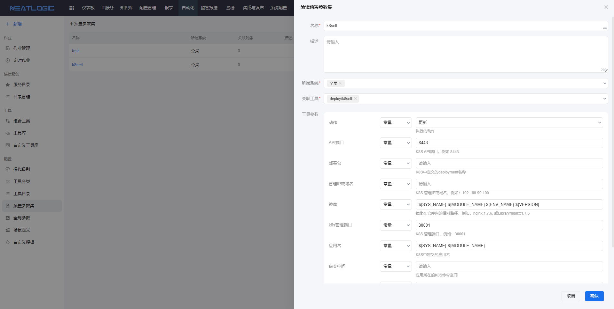

#### Directly Associating Predefined Parameter Sets with Tools
When tools are associated with predefined parameter sets, the configuration of the tool will default to

enable the associated predefined parameter set, and the input parameter mappings of the tool will default to the values
specified in the predefined parameter set.
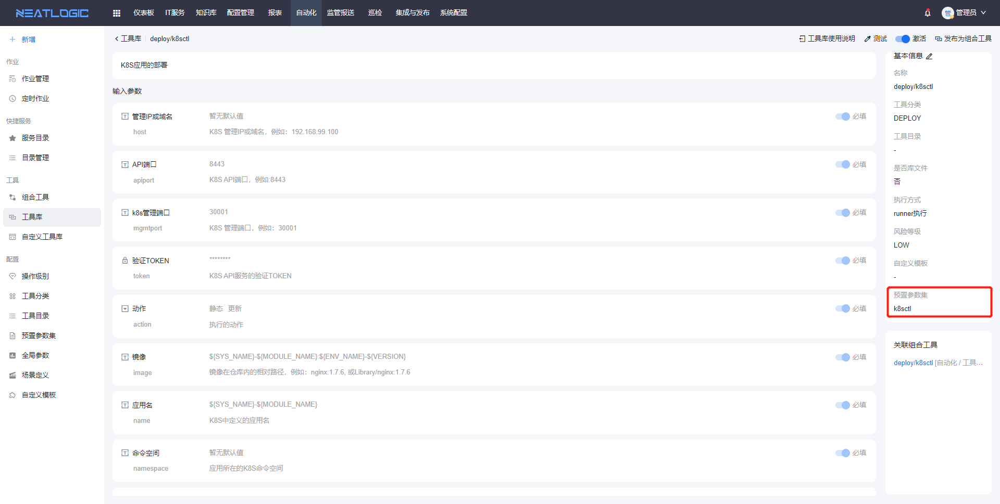

#### Not Associating Predefined Parameter Sets with Tools

When tools are not associated with predefined parameter sets, the configuration of the tool will default to disable the
predefined parameter set. If the predefined parameter set is enabled, any predefined parameter set associated with the
current tool can be selected.
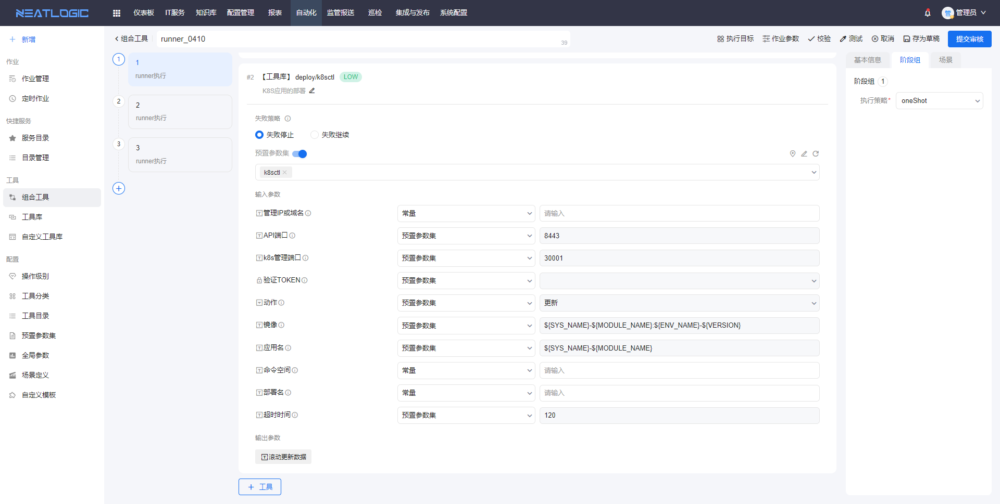

## All Features

<table><tr><td>Number</td><td>Category</td><td>Feature</td><td>Description</td></tr><tr><td>1</td><td rowspan="5">Parameters</td><td rowspan="2">Global Parameters</td><td>Supports basic management of global parameters for automation jobs, including add, delete, modify, and query operations.</td></tr><tr><td>2</td><td>Supports global parameter field types such as text, password, date, text area, etc.</td></tr><tr><td>3</td><td rowspan="3">Predefined Parameters</td><td>Supports basic management of predefined parameters for automation jobs, including add, delete, modify, and query operations.</td></tr><tr><td>4</td><td>Supports predefined parameter sets based on tool libraries and atomic operations.</td></tr><tr><td>5</td><td>Supports referencing global parameters in predefined parameter sets.</td></tr><tr><td>6</td><td rowspan="5">Classification</td><td rowspan="3">Tool Classification</td><td>Supports basic management of tool classifications, including add, delete, modify, and query operations.</td></tr><tr><td>7</td><td>Supports viewing the statistics of tool libraries, custom atomic operations, and associated orchestrations under each classification.</td></tr><tr><td>8</td><td>Supports setting tool library permissions based on types.</td></tr><tr><td>9</td><td rowspan="2">Tool Catalog</td><td>Supports basic management of tool catalogs, including add, delete, modify, and query operations.</td></tr><tr><td>10</td><td>Supports setting permissions for tool libraries based on catalogs.</td></tr><tr><td>11</td><td rowspan="3">Scenarios</td><td rowspan="3">Orchestration Scenarios</td><td>Supports basic management of automation scenarios, including add, delete, modify, and query operations.</td></tr><tr><td>12</td><td>Supports defining automation scenario classifications based on types, scenarios, and job positions.</td></tr><tr><td>13</td><td>Supports setting different usage scenarios within a combined orchestration, where each scenario represents a different execution phase of the orchestration. This allows for multiple usage scenarios in a single orchestration.</td></tr><tr><td>14</td><td rowspan="15">Tool Libraries</td><td rowspan="4">Built-in Tool Libraries</td><td>Platform includes commonly used basic tool libraries, including basic tools, file operations, configuration backups, etc. Each automation module also has its own module-specific tool library, such as service start/stop, disaster recovery switch, software installation, SQL processing, inspection, backup, and automatic collection.</td></tr><tr><td>15</td><td>Supports online testing of built-in tools.</td></tr><tr><td>16</td><td>Supports online help for built-in tool libraries, including input parameters, output parameters, execution methods, and risk levels.</td></tr><tr><td>17</td><td>Supports associating custom display templates with built-in tool libraries.</td></tr><tr><td>18</td><td rowspan="11">Custom Atomic Operations</td><td>Supports common scripting languages including Python, Ruby, VBScript, Perl, PowerShell, CMD, Bash, csh, ksh, sh, and JavaScript.</td></tr><tr><td>19</td><td>Supports various input and output parameter types, including text, text area, password, file, time, date, single selection, multi-selection, switch, account, JSON object, node information. Parameters can have default values.</td></tr><tr><td>20</td><td>Supports command-line parameters with the ability to specify or not specify the number of command-line parameters.</td></tr><tr><td>21</td><td>Supports setting risk levels for custom tools.</td></tr><tr><td>22</td><td>Supports binding custom tools to tool catalogs.</td></tr><tr><td>23</td><td>Supports Git version management, allowing import and export of atomic operations from Git.</td></tr><tr><td>24</td><td>Supports version auditing and publishing for custom tools.</td></tr><tr><td>25</td><td>Supports common connection protocols such as SSH, WinRM, Tagent, IPMI, HTTP, HTTPS, Telnet, SNMP, SMI, etc.</td></tr><tr><td>26</td><td>Supports connection methods, such as remote target machine execution, local execution, and local-to-remote execution.</td></tr><tr><td>27</td><td>Supports online testing and validation of custom atomic operations.</td></tr><tr><td>28</td><td>Supports import and export of remote operations for environment migration.</td></tr><tr><td>29</td><td rowspan="17">Combined Tools</td><td rowspan="17">Orchestration Management</td><td>Supports basic management functions for combined orchestration, including add, delete, modify, and query operations.</td></tr><tr><td>30</td><td>Supports custom orchestration design with graphical drag-and-drop layout.</td></tr><tr><td>31</td><td>Supports copying existing combined orchestrations to create new orchestrations similar to the original ones.</td></tr><tr><td>32</td><td>Supports customizing stages or stage groups within combined orchestrations. Tools within stages can be executed in series, parallel, or based on conditional logic.</td></tr><tr><td>33</td><td>Supports execution policies for stages in combined orchestrations, including full execution, batch execution, and gradual rollout.</td></tr><tr><td>34</td><td>Supports dividing combined orchestrations into logical scenarios. During execution, scenarios can be selected for quick execution based on the logical scenarios.</td></tr><tr><td>35</td><td>Supports job notification strategies for stages in combined orchestrations.</td></tr><tr><td>36</td><td>Supports defining multiple tool libraries or custom atomic operations within stages. Data transfer within or across stages is supported.</td></tr><tr><td>37</td><td>Supports defining job parameters for combined orchestrations, including text, text area, password, file, time, date, single selection, multi-selection, switch, account, JSON object, node information. Parameters can have default values, be required, and have validation rules.</td></tr><tr><td>38</td><td>Supports passing parameters between tool libraries or custom operations and stages within combined orchestrations.</td></tr><tr><td>39</td><td>Supports parameter template referencing for tool libraries or custom atomic operations, enabling batch modification and assignment.</td></tr><tr><td>40</td><td>Supports authorization for combined orchestrations, including execution permissions and modification permissions.</td></tr><tr><td>41</td><td>Supports predefined execution targets for combined orchestrations, as well as dynamic selection of execution targets during execution. Stage-specific target settings take precedence over global orchestration targets.</td></tr><tr><td>42</td><td>Supports referencing job parameters, upstream tool output parameters, predefined parameter sets, global parameters, and static parameters within combined orchestrations.</td></tr><tr><td>43</td><td>Supports dynamic target configuration for stages in combined orchestrations, where output parameters from upstream stages serve as execution targets for downstream stages.</td></tr><tr><td>44</td><td>Supports execution policies for tool libraries and custom atomic operations, such as whether to continue or terminate on failure.</td></tr><tr><td>45</td><td>Supports export and import of combined orchestrations for migration between environments.</td></tr><tr><td>46</td><td rowspan="10">Combined Execution</td><td rowspan="10">Orchestration Execution</td><td>Supports scheduling combined orchestrations for execution.</td></tr><tr><td>47</td><td>Supports immediate execution of combined orchestrations by authorized users.</td></tr><tr><td>48</td><td>Supports setting concurrent quantity and batch execution for combined orchestrations.</td></tr><tr><td>49</td><td>Supports multiple methods for specifying execution targets, including direct node selection, target range specification using filters, and text input.</td></tr><tr><td>50</td><td>Supports dynamic target configuration, where upstream node output parameters are used as execution targets.</td></tr><tr><td>51</td><td>Supports failure termination and failure continuation strategies. When some nodes fail, intervention is possible, and errors can be ignored for continued execution.</td></tr><tr><td>52</td><td>Supports termination and rerun operations, with options for full rerun or skipping successful nodes.</td></tr><tr><td>53</td><td>Supports validation of orchestration execution, with validation completed jobs not eligible for rerun, termination, and other operations.</td></tr><tr><td>54</td><td>Supports exporting job results to Excel, including node result information, execution stage information, and job output parameters.</td></tr><tr><td>55</td><td>Supports viewing and exporting node run logs, output parameter viewing and exporting, and viewing single node run logs.</td></tr><tr><td>56</td><td rowspan="4">Execution Agent</td><td rowspan="4">Agent</td><td>Supports common operating systems, such as Windows, Linux, AIX.</td></tr><tr><td>57</td><td>Supports distributed deployment and execution based on management network segments.</td></tr><tr><td>58</td><td>Supports online status, log, and configuration viewing, as well as online management operations such as start and stop.</td></tr><tr><td>59</td><td>Agent has minimal resource consumption on the operating system, with resource limits such as CPU <= 2% and memory <= 200MB.</td></tr></table>

## Suitable scenarios

<table>
    <tr>
       <td>Type</td>
<td>Target Object</td>
<td>Collection</td>
<td>Relationship Calculation</td>
<td>Inspection</td>
<td>Configuration Backup</td>
<td>Configuration Comparison</td>
<td>Installation Delivery</td>
<td>Switching</td>
<td>Business Scheduling</td>
<td>Data Backup</td>
<td>Emergency Operation</td>
<td>SQL Execution</td>
<td>Change</td>
<td>Patch Installation</td>
    </tr>
<tr><td>OS</td><td>aix</td><td>✅</td><td>✅</td><td>✅</td><td>✅</td><td>✅</td><td>✅</td><td>✅</td><td>✅</td><td></td><td>✅</td><td></td><td>✅</td><td>✅</td><td>✅</td></tr><tr><td></td><td>linux</td><td>✅</td><td>✅</td><td>✅</td><td>✅</td><td>✅</td><td>✅</td><td>✅</td><td>✅</td><td></td><td>✅</td><td></td><td>✅</td><td>✅</td><td>✅</td></tr><tr><td></td><td>windows</td><td>✅</td><td>✅</td><td>✅</td><td>✅</td><td>✅</td><td>✅</td><td>✅</td><td>✅</td><td></td><td>✅</td><td></td><td>✅</td><td>✅</td><td>✅</td></tr><tr><td>Server Hardware</td><td>x86 Server</td><td>✅</td><td>✅</td><td>✅</td><td></td><td></td><td>✅</td><td></td><td></td><td></td><td></td><td></td><td>✅</td><td></td><td></td></tr><tr><td></td><td>minicomputer</td><td>✅</td><td></td><td>✅</td><td></td><td></td><td>✅</td><td></td><td></td><td></td><td></td><td></td><td>✅</td><td></td><td></td></tr><tr><td>virtualization</td><td>vmware</td><td>✅</td><td>✅</td><td>✅</td><td></td><td></td><td>✅</td><td></td><td></td><td></td><td></td><td></td><td></td><td></td><td></td></tr><tr><td></td><td>smartx</td><td>✅</td><td>✅</td><td>✅</td><td></td><td></td><td></td><td></td><td></td><td></td><td></td><td></td><td></td><td></td><td></td></tr><tr><td></td><td>Huawei FusionComputer</td><td>✅</td><td>✅</td><td>✅</td><td></td><td></td><td>✅</td><td></td><td></td><td></td><td></td><td></td><td>✅</td><td></td><td></td></tr><tr><td>Middleware</td><td>jdk</td><td>✅</td><td>✅</td><td>✅</td><td></td><td></td><td>✅</td><td></td><td></td><td></td><td></td><td></td><td></td><td></td><td></td></tr><tr><td></td><td>tomcat</td><td>✅</td><td>✅</td><td>✅</td><td>✅</td><td>✅</td><td>✅</td><td></td><td></td><td></td><td>✅</td><td></td><td>✅</td><td></td><td>✅</td></tr><tr><td></td><td>nginx</td><td>✅</td><td>✅</td><td>✅</td><td>✅</td><td>✅</td><td>✅</td><td></td><td></td><td></td><td>✅</td><td></td><td>✅</td><td></td><td>✅</td></tr><tr><td></td><td>weblogic</td><td>✅</td><td>✅</td><td>✅</td><td>✅</td><td>✅</td><td>✅</td><td></td><td></td><td></td><td>✅</td><td></td><td>✅</td><td>✅</td><td>✅</td></tr><tr><td></td><td>websphere</td><td>✅</td><td>✅</td><td>✅</td><td>✅</td><td>✅</td><td>✅</td><td></td><td></td><td></td><td>✅</td><td></td><td>✅</td><td>✅</td><td>✅</td></tr><tr><td></td><td>redis</td><td>✅</td><td>✅</td><td>✅</td><td>✅</td><td>✅</td><td></td><td></td><td></td><td></td><td>✅</td><td></td><td>✅</td><td></td><td></td></tr><tr><td></td><td>zookeeper</td><td>✅</td><td>✅</td><td>✅</td><td>✅</td><td>✅</td><td></td><td></td><td></td><td></td><td>✅</td><td></td><td></td><td></td><td></td></tr><tr><td></td><td>ActiveMQ</td><td>✅</td><td>✅</td><td>✅</td><td>✅</td><td>✅</td><td></td><td></td><td></td><td></td><td>✅</td><td></td><td></td><td></td><td></td></tr><tr><td></td><td>Apache</td><td>✅</td><td>✅</td><td>✅</td><td>✅</td><td>✅</td><td></td><td></td><td></td><td></td><td>✅</td><td></td><td></td><td></td><td>✅</td></tr><tr><td></td><td>Hadoop</td><td>✅</td><td>✅</td><td>✅</td><td>✅</td><td>✅</td><td></td><td></td><td></td><td></td><td>✅</td><td></td><td></td><td></td><td></td></tr><tr><td></td><td>IIS</td><td>✅</td><td>✅</td><td>✅</td><td>✅</td><td>✅</td><td></td><td></td><td></td><td></td><td>✅</td><td></td><td></td><td></td><td>✅</td></tr><tr><td></td><td>Java</td><td>✅</td><td>✅</td><td>✅</td><td>✅</td><td>✅</td><td></td><td></td><td></td><td></td><td>✅</td><td></td><td></td><td></td><td>✅</td></tr><tr><td></td><td>Jboss</td><td>✅</td><td>✅</td><td>✅</td><td>✅</td><td>✅</td><td></td><td></td><td></td><td></td><td>✅</td><td></td><td></td><td></td><td>✅</td></tr><tr><td></td><td>Jetty</td><td>✅</td><td>✅</td><td>✅</td><td>✅</td><td>✅</td><td></td><td></td><td></td><td></td><td>✅</td><td></td><td></td><td></td><td>✅</td></tr><tr><td></td><td>Kafka</td><td>✅</td><td>✅</td><td>✅</td><td>✅</td><td>✅</td><td></td><td></td><td></td><td></td><td>✅</td><td></td><td></td><td></td><td></td></tr><tr><td></td><td>Keepalived</td><td>✅</td><td>✅</td><td>✅</td><td>✅</td><td>✅</td><td></td><td></td><td></td><td></td><td>✅</td><td></td><td></td><td></td><td></td></tr><tr><td></td><td>Lighttpd</td><td>✅</td><td>✅</td><td>✅</td><td>✅</td><td>✅</td><td></td><td></td><td></td><td></td><td>✅</td><td></td><td></td><td></td><td></td></tr><tr><td></td><td>Memcached</td><td>✅</td><td>✅</td><td>✅</td><td>✅</td><td>✅</td><td></td><td></td><td></td><td></td><td>✅</td><td></td><td></td><td></td><td></td></tr><tr><td></td><td>PHP</td><td>✅</td><td>✅</td><td>✅</td><td>✅</td><td>✅</td><td></td><td></td><td></td><td></td><td>✅</td><td></td><td></td><td></td><td>✅</td></tr><tr><td></td><td>Python</td><td>✅</td><td>✅</td><td>✅</td><td>✅</td><td>✅</td><td></td><td></td><td></td><td></td><td>✅</td><td></td><td></td><td></td><td></td></tr><tr><td></td><td>RabbitMQ</td><td>✅</td><td>✅</td><td>✅</td><td>✅</td><td>✅</td><td></td><td></td><td></td><td></td><td>✅</td><td></td><td></td><td></td><td></td></tr><tr><td></td><td>Resin</td><td>✅</td><td>✅</td><td>✅</td><td>✅</td><td>✅</td><td></td><td></td><td></td><td></td><td>✅</td><td></td><td></td><td></td><td></td></tr><tr><td></td><td>Tuxedo</td><td>✅</td><td>✅</td><td>✅</td><td>✅</td><td>✅</td><td></td><td></td><td></td><td></td><td>✅</td><td></td><td></td><td></td><td></td></tr><tr><td></td><td>VCS</td><td>✅</td><td>✅</td><td>✅</td><td>✅</td><td>✅</td><td></td><td></td><td></td><td></td><td>✅</td><td></td><td></td><td></td><td></td></tr><tr><td>Database</td><td>mysql</td><td>✅</td><td>✅</td><td>✅</td><td>✅</td><td>✅</td><td>✅</td><td>✅</td><td>✅</td><td>✅</td><td>✅</td><td>✅</td><td></td><td></td><td>✅</td></tr><tr><td></td><td>oracle</td><td>✅</td><td>✅</td><td>✅</td><td>✅</td><td>✅</td><td>✅</td><td>✅</td><td>✅</td><td>✅</td><td>✅</td><td>✅</td><td></td><td></td><td>✅</td></tr><tr><td></td><td>informix</td><td>✅</td><td>✅</td><td>✅</td><td>✅</td><td>✅</td><td></td><td>✅</td><td>✅</td><td></td><td>✅</td><td>✅</td><td></td><td></td><td>✅</td></tr><tr><td></td><td>mongodb</td><td>✅</td><td>✅</td><td>✅</td><td>✅</td><td>✅</td><td></td><td>✅</td><td>✅</td><td></td><td>✅</td><td>✅</td><td></td><td></td><td>✅</td></tr><tr><td></td><td>sybase</td><td>✅</td><td>✅</td><td>✅</td><td>✅</td><td>✅</td><td></td><td>✅</td><td>✅</td><td></td><td>✅</td><td>✅</td><td></td><td></td><td>✅</td></tr><tr><td></td><td>SQLServer</td><td>✅</td><td>✅</td><td>✅</td><td>✅</td><td>✅</td><td></td><td>✅</td><td>✅</td><td></td><td>✅</td><td>✅</td><td></td><td></td><td>✅</td></tr><tr><td></td><td>db2</td><td>✅</td><td>✅</td><td>✅</td><td>✅</td><td>✅</td><td></td><td></td><td></td><td></td><td></td><td>✅</td><td></td><td></td><td>✅</td></tr><tr><td></td><td>ElasticSearch</td><td>✅</td><td>✅</td><td>✅</td><td>✅</td><td>✅</td><td></td><td></td><td></td><td></td><td></td><td>✅</td><td></td><td></td><td>✅</td></tr><tr><td></td><td>Postgresql</td><td>✅</td><td>✅</td><td>✅</td><td>✅</td><td>✅</td><td></td><td></td><td></td><td></td><td></td><td>✅</td><td></td><td></td><td>✅</td></tr><tr><td></td><td>Redis</td><td>✅</td><td>✅</td><td>✅</td><td>✅</td><td>✅</td><td></td><td>✅</td><td>✅</td><td></td><td>✅</td><td></td><td></td><td></td><td>✅</td></tr><tr><td>Container</td><td>docker</td><td>✅</td><td>✅</td><td>✅</td><td></td><td></td><td></td><td></td><td></td><td></td><td>✅</td><td>✅</td><td>✅</td><td></td><td></td></tr><tr><td></td><td>k8s</td><td>✅</td><td>✅</td><td>✅</td><td></td><td></td><td></td><td></td><td></td><td></td><td></td><td></td><td></td><td></td><td></td></tr><tr><td>Load Balance</td><td>F5</td><td>✅</td><td>✅</td><td>✅</td><td>✅</td><td>✅</td><td></td><td>✅</td><td>✅</td><td></td><td>✅</td><td></td><td>✅</td><td></td><td></td></tr><tr><td></td><td>A10</td><td>✅</td><td>✅</td><td>✅</td><td>✅</td><td>✅</td><td></td><td>✅</td><td>✅</td><td></td><td>✅</td><td></td><td>✅</td><td></td><td></td></tr><tr><td></td><td>redware</td><td>✅</td><td>✅</td><td>✅</td><td>✅</td><td>✅</td><td></td><td>✅</td><td></td><td></td><td>✅</td><td></td><td>✅</td><td></td><td></td></tr><tr><td>Router/Switch</td><td>Cisco</td><td>✅</td><td>✅</td><td>✅</td><td>✅</td><td>✅</td><td></td><td>✅</td><td></td><td></td><td>✅</td><td></td><td>✅</td><td></td><td></td></tr><tr><td></td><td>Huawei</td><td>✅</td><td>✅</td><td>✅</td><td>✅</td><td>✅</td><td></td><td>✅</td><td></td><td></td><td>✅</td><td></td><td>✅</td><td></td><td></td></tr><tr><td></td><td>H3C</td><td>✅</td><td>✅</td><td>✅</td><td>✅</td><td>✅</td><td></td><td>✅</td><td></td><td></td><td>✅</td><td></td><td>✅</td><td></td><td></td></tr><tr><td></td><td>Juniper</td><td>✅</td><td>✅</td><td>✅</td><td>✅</td><td>✅</td><td></td><td></td><td></td><td></td><td></td><td></td><td>✅</td><td></td><td></td></tr><tr><td></td><td>Ruijie</td><td>✅</td><td>✅</td><td>✅</td><td>✅</td><td>✅</td><td></td><td></td><td></td><td></td><td></td><td></td><td>✅</td><td></td><td></td></tr><tr><td></td><td>HillStone</td><td>✅</td><td>✅</td><td>✅</td><td>✅</td><td>✅</td><td></td><td></td><td></td><td></td><td></td><td></td><td>✅</td><td></td><td></td></tr><tr><td>Firewall</td><td>Huawei</td><td>✅</td><td></td><td>✅</td><td>✅</td><td>✅</td><td></td><td></td><td></td><td></td><td></td><td></td><td>✅</td><td></td><td></td></tr><tr><td></td><td>CheckPoint</td><td>✅</td><td></td><td>✅</td><td>✅</td><td>✅</td><td></td><td></td><td></td><td></td><td></td><td></td><td>✅</td><td></td><td></td></tr><tr><td></td><td>Juniper</td><td>✅</td><td></td><td>✅</td><td>✅</td><td>✅</td><td></td><td></td><td></td><td></td><td></td><td></td><td>✅</td><td></td><td></td></tr><tr><td></td><td>HillStone</td><td>✅</td><td></td><td>✅</td><td>✅</td><td>✅</td><td></td><td></td><td></td><td></td><td></td><td></td><td>✅</td><td></td><td></td></tr><tr><td></td><td>TopSec</td><td>✅</td><td></td><td>✅</td><td>✅</td><td>✅</td><td></td><td></td><td></td><td></td><td></td><td></td><td>✅</td><td></td><td></td></tr><tr><td></td><td>H3C</td><td>✅</td><td></td><td>✅</td><td>✅</td><td>✅</td><td></td><td></td><td></td><td></td><td></td><td></td><td>✅</td><td></td><td></td></tr><tr><td>Fiber optic switch</td><td>Brocade</td><td>✅</td><td>✅</td><td>✅</td><td></td><td></td><td></td><td></td><td></td><td></td><td></td><td></td><td></td><td></td><td></td></tr><tr><td></td><td>IBM</td><td>✅</td><td>✅</td><td>✅</td><td></td><td></td><td></td><td></td><td></td><td></td><td></td><td></td><td></td><td></td><td></td></tr><tr><td></td><td>EMC</td><td>✅</td><td>✅</td><td>✅</td><td></td><td></td><td></td><td></td><td></td><td></td><td></td><td></td><td></td><td></td><td></td></tr><tr><td></td><td>HP</td><td>✅</td><td>✅</td><td>✅</td><td></td><td></td><td></td><td></td><td></td><td></td><td></td><td></td><td></td><td></td><td></td></tr><tr><td></td><td>Huawei</td><td>✅</td><td>✅</td><td>✅</td><td></td><td></td><td></td><td></td><td></td><td></td><td></td><td></td><td></td><td></td><td></td></tr><tr><td>Storage</td><td>EMC_Vnx</td><td>✅</td><td>✅</td><td>✅</td><td></td><td></td><td></td><td></td><td></td><td></td><td></td><td></td><td></td><td></td><td></td></tr><tr><td></td><td>EMC_Vplex</td><td>✅</td><td>✅</td><td>✅</td><td></td><td></td><td></td><td></td><td></td><td></td><td></td><td></td><td></td><td></td><td></td></tr><tr><td></td><td>EMC_RPA</td><td>✅</td><td>✅</td><td>✅</td><td></td><td></td><td></td><td></td><td></td><td></td><td></td><td></td><td></td><td></td><td></td></tr><tr><td></td><td>HP_3PAR</td><td>✅</td><td>✅</td><td>✅</td><td></td><td></td><td></td><td></td><td></td><td></td><td></td><td></td><td></td><td></td><td></td></tr><tr><td></td><td>HDS_AMS</td><td>✅</td><td>✅</td><td>✅</td><td></td><td></td><td></td><td></td><td></td><td></td><td></td><td></td><td></td><td></td><td></td></tr><tr><td></td><td>HDS_VSP</td><td>✅</td><td>✅</td><td>✅</td><td></td><td></td><td></td><td></td><td></td><td></td><td></td><td></td><td></td><td></td><td></td></tr><tr><td></td><td>HuaWei</td><td>✅</td><td>✅</td><td>✅</td><td></td><td></td><td></td><td></td><td></td><td></td><td></td><td></td><td></td><td></td><td></td></tr><tr><td></td><td>IBM_DS</td><td>✅</td><td>✅</td><td>✅</td><td></td><td></td><td></td><td></td><td></td><td></td><td></td><td></td><td></td><td></td><td></td></tr><tr><td></td><td>IBM_F900</td><td>✅</td><td>✅</td><td>✅</td><td></td><td></td><td></td><td></td><td></td><td></td><td></td><td></td><td></td><td></td><td></td></tr><tr><td></td><td>IBM_Flash</td><td>✅</td><td>✅</td><td>✅</td><td></td><td></td><td></td><td></td><td></td><td></td><td></td><td></td><td></td><td></td><td></td></tr><tr><td></td><td>IBM_SVC</td><td>✅</td><td>✅</td><td>✅</td><td></td><td></td><td></td><td></td><td></td><td></td><td></td><td></td><td></td><td></td><td></td></tr><tr><td></td><td>IBM_V7000</td><td>✅</td><td>✅</td><td>✅</td><td></td><td></td><td></td><td></td><td></td><td></td><td></td><td></td><td></td><td></td><td></td></tr><tr><td></td><td>NetApp</td><td>✅</td><td>✅</td><td>✅</td><td></td><td></td><td></td><td></td><td></td><td></td><td></td><td></td><td></td><td></td><td></td></tr><tr><td></td><td>FUJITSU</td><td>✅</td><td>✅</td><td>✅</td><td></td><td></td><td></td><td></td><td></td><td></td><td></td><td></td><td></td><td></td><td></td></tr><tr><td>DNS</td><td>DNS</td><td>✅</td><td>✅</td><td>✅</td><td>✅</td><td>✅</td><td></td><td>✅</td><td></td><td></td><td></td><td></td><td>✅</td></tr></table>
